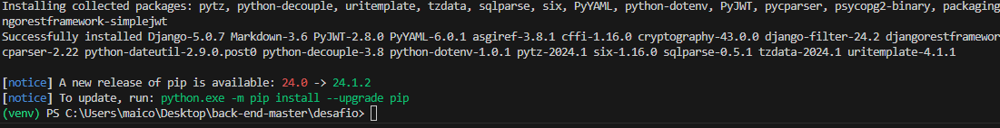

# Desafio

API para cadastro e consulta de número de cartão completo:

<h4>Preparação do ambiente:</h4>

<ol>

<li>Criar um arquivo .env:</li>

<li>Para criar o ambiente virtual do python digite no terminal:</li>
 
Windows

    python -m venv venv

Linux & Mac

    python3 -m venv venv

<li>Ative o ambiente virtual:</li>
 
Windows:

    # In cmd.exe
    venv\Scripts\activate.bat
    # In PowerShell
    venv\Scripts\Activate.ps1

Linux and MacOS:

    $ source myvenv/bin/activate

<li>Dentro da pasta desafio é preciso instalar as dependencias do arquivo requirements.txt usando o terminal com o comando:</li>
    
    pip install -r .\requirements.txt

Observação: No VS code após instalar as dependencias as vezes é necessário fechar o terminal e o editor de código para que as dependencias sejam reconhecidas. 

<li>Copiar os dados do arquivo .envexample ou criar uma nova SECRET_KEY para o django e adicionar ao arquivo .env:</li>

Envexample:

Criar uma nova SECRET_KEY:

    python -c "from django.core.management.utils import get_random_secret_key; print(get_random_secret_key())"
    

Dados copiados para o arquivo .env:

<li>Determinar o banco de dados a ser usado no arquivo settings.py em DATABASES. Por padrão para testes o django vem com sqlite configurado.</li>

Exemplo sqlite:

Exemplo PostgreSql:

<li>Com o ambiente virtual ativo é necessario executar as migrações:</li>

Para criar as migrações digite: 

    python .\manage.py makemigrations
    

Para migrar:

    python .\manage.py migrate
    

<li>Com o ambiente virtual ativo é necessário criar o primeiro usuário do django digite:</li>

    python manage.py createsuperuser
    

<li>Para iniciar o django com o ambiente virtual ativo digite no terminal:</li>

    python manage.py runserver

 

</ol>

<h4>Como usar os endpoints:</h4>

<ol>
    
<li>/api/token/: É utilizado para gerar o token JWT e o refresh.</li>
        
 

<li>/api/upload/: É utilizado para enviar o arquivo txt.</li>
    
 
    
<li>/api/check/: É utilizado para enviar o número de um ou mais cartões e receber como resposta um identificador unico.</li>
    
 
    
</ol>

<strong>IMPORTANTE: Os dados de todas as requisições são salvos em um arquivo de log na pasta logs com o nome de arquivo django.log</strong>

 

Observação geral:

 

Os exemplos abaixo foram criados com o postman. Com exceção do endpoint /api/token/ os demais exigem que o token seja passado no Bearer Token.

 

<ol>
    
<li>Endpoint /api/token/ para conseguir um token JWT e o refresh:</li>

Informar o user e a senha:

obs: Aqui foi utilizado o superusuario para o teste.

<li>Endpoint /api/upload/ para envio do arquivo em formato txt:</li>
 
Informar o token no bearer token em authorization:

Informar no Body a key file e adicionar o arquivo de upload no value:

O postman tem acesso limitado ao sistema para o upload de arquivos no body é necessário alterar as configurações ou colocar os arquivos na pasta files como o exemplo abaixo:

<li>Endpoint /api/check/ para enviar um ou mais cartões e receber um identificador unico:</li>
 
Assim como na chamada anterior é necessário informar o token no bearer token em authorization:

Nesta chamada é possivel informar um ou mais numeros de cartões e a resposta será um identificador unico:

Exemplo de body:

    [
        {
            "numero_cartao": "4456897999999999"
        },
        {
            "numero_cartao": "4456897912999999"
        }
    ]

</ol>

Os dados são salvos no banco de dados, sendo que destes o cartão é criptografado para maior segurança:

Exemplo dados salvos PostgreSql:

Exemplo dados salvos SqLite:

Agradeço a atenção
