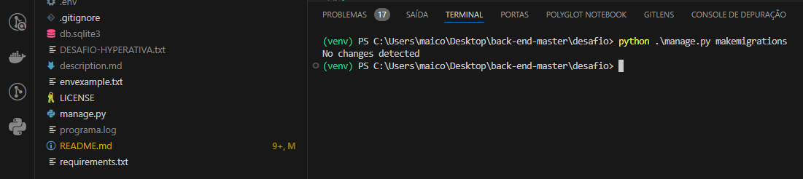

# desafio

API para cadastro e consulta de número de cartão completo:

<h4>Setup do ambiente</h4>

<ol>

<li>Criar um arquivo .env:</li>

<li>Criar uma pasta de ambiente virtual do python com python -m venv venv no windows ou python3 -m venv venv no linux:</li>

<li>Ativar o ambiente virtual no cmd venv\Scripts\activate.bat, no powershell venv\Scripts\Activate.ps1 ou no linux source myvenv/bin/activate</li>

<li>Dentro da pasta desafio é preciso instalar as dependencias do arquivo requirements.txt usando o terminal com o comando pip install -r .\requirements.txt</li>

<li>copiar os dados do arquivo .envexample ou criar uma nova SECRET_KEY para o django e adicionar ao arquivo .env:</li>

<strong>envexample</strong>

<strong>criar uma nova SECRET_KEY</strong>
Com ambiente virtual ativado digite: python -c "from django.core.management.utils import get_random_secret_key; print(get_random_secret_key())"

<strong>dados copiados para o arquivo .env</strong>

<li>Determinar o banco de dados a ser usado no arquivo settings.py em DATABASES. Por padrão para testes o django vem com sqlite configurado.</li>

<strong>exemplo sqlite</strong>

<strong>exemplo PostgreSql</strong>

<li>Com o ambiente virtual ativo é necessario executar as migrações.</li>

<strong>Para criar as migrações digite: python .\manage.py makemigrations<strong>

<strong>Para migrar: python .\manage.py migrate<strong>

<li>Agora é preciso adicionar o primeiro usuário do sistema:</li>

<strong>Ainda no terminal com o ambiente virutual ativo digite: python manage.py createsuperuser<strong>

<strong>Ainda no terminal com o ambiente virtual ativo digite: python manage.py createsuperuser<strong>

<ol>